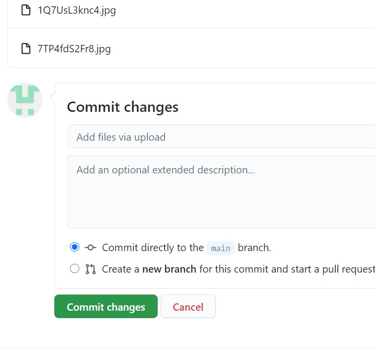

# Завдання на оцінку "добре" створити звіт у файлі Readme із відповідями на питання, додати до нього картинки із скрин-шотами:
1. *Як налаштувати репозиторій, щоб він мав вигляд як сайт у мережі Інтернет?*

Необхідно створити новий репозиторій таким чином, щоб він був однаковим з вашим логіном та мав приставку github.io. 

Після цього потрібно завантажити файли вашого репозиторію, натиснувши кнопку Upload files.

У цьому вікні натисніть на посилання Choose your files та оберіть файли.

Після цього натисніть на кнопку Commit changes для того, щоб прийняти зміни 

Ваш сайт буде доступний за посиланням https://kirafisher000.github.io.

2. *Як завантажити файли до репозиторію?*

Щоб завантажити файли вашого репозиторію, натисніть кнопку Upload files.

У цьому вікні натисніть на посилання Choose your files та оберіть файли.

Після цього натисніть на кнопку Commit changes для того, щоб прийняти зміни 

